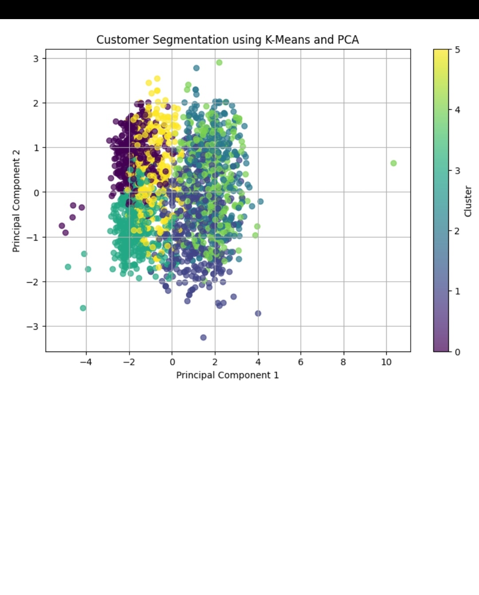
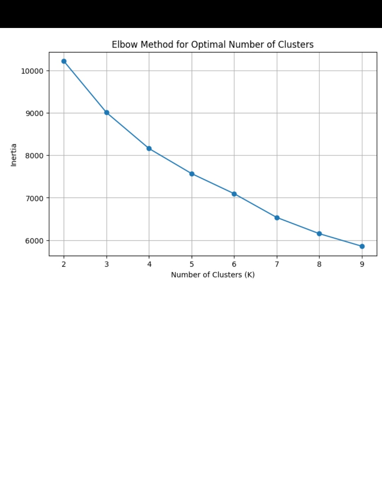

# Customer Segmentation using K-Means Clustering

## Thiranex Data Analytics Internship – Task 2

### Project Overview
This project segments customers into meaningful groups based on their demographic and purchasing behavior using Machine Learning.

The project uses the K-Means clustering algorithm to identify different customer segments and supports business decision-making through customer profiling and visualization.

## Objective
- Segment customers based on behavior and demographics
- Analyze customer purchasing patterns
- Identify high-value and low-value customer groups
- Visualize customer segments
- Provide business recommendations for each segment

## Dataset
The project uses the Customer Personality Analysis dataset containing customer demographic, purchasing, campaign response, and channel interaction information.

After cleaning missing Income values, the dataset contains 2,216 customers.

## Data Preparation
The following preprocessing and feature engineering steps were performed:

- Removed records with missing Income values
- Converted customer registration date to datetime
- Calculated customer Age
- Created TotalChildren from Kidhome and Teenhome
- Created TotalSpending from product spending columns
- Calculated CustomerTenureDays
- Created AcceptedAny to identify campaign responders

## Features Used for Clustering

The following features were selected:

- Age
- Income
- TotalSpending
- NumWebPurchases
- NumStorePurchases
- NumWebVisitsMonth
- Recency

The features were standardized using StandardScaler.

## Machine Learning
K-Means clustering was used for customer segmentation.

The Elbow Method and Silhouette Score were evaluated to determine a suitable number of clusters.

The final model uses **6 customer clusters**.

## PCA Visualization
Principal Component Analysis (PCA) was used to reduce the standardized features to two dimensions for visualization.

The first two principal components explain approximately **57.7% of the total variance**.

## Customer Segments

The identified segments include:

1. Low-Value / Inactive Customers
2. Regular High-Value Customers
3. Affluent Older Customers
4. Recent Low-Value Customers
5. Premium High-Value Customers
6. Older Low-Value Customers

## Business Recommendations

### Premium High-Value Customers
Focus on customer retention, loyalty rewards, premium offers, and personalized recommendations.

### Affluent Older Customers
Provide personalized product recommendations and loyalty benefits.

### Regular High-Value Customers
Encourage repeat purchases and cross-selling.

### Recent Low-Value Customers
Use introductory offers and personalized promotions to increase future purchases.

### Low-Value / Inactive Customers
Use re-engagement campaigns and targeted discounts.

### Older Low-Value Customers
Provide relevant products and personalized promotions.

## Technologies Used

- Python
- Pandas
- NumPy
- Matplotlib
- Scikit-learn
- Google Colab
- K-Means Clustering
- PCA

## Project Outcome

The project successfully groups customers into six behavior-based segments and provides actionable business recommendations for targeted marketing and customer retention.

## Internship

**Organization:** Thiranex  
**Domain:** Data Analytics  
**Task:** Task 2 – Customer Segmentation Project
## Visualizations

### Elbow Method
The Elbow Method was used to evaluate the suitable number of clusters.

### Customer Segmentation using K-Means and PCA
PCA was used to visualize the customer clusters in two dimensions.

